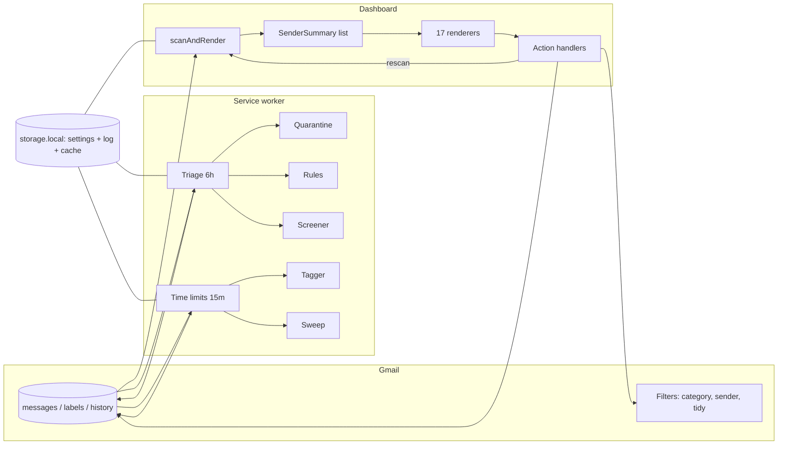

# Cluster engineering report: pipeline, algorithms, data and reactivity, process

_2026-10-05. Software engineering team. Branch `feature/inbox-time-limits` at `22ba332` plus the
uncommitted working tree. Builds on, and does not repeat:_

- `research/2026-10-05-sync-and-ui-architecture.md` (the "sync note": rescan diagnosis, IndexedDB
  and `history.list` design, quota math, proposed IA),
- `research/2026-10-05-algorithm-audit-and-upgrades.md` (the "audit": caveats 1-30, upgrades U1-U16,
  reason codes, evaluation plan),
- `research/2026-10-05-inbox-intelligence-research.md` (the "intelligence note"),
- `research/team-2026-10-05/ux-report.md` (the "UX report", especially §4 and §7.2),
- `docs/testing.md` and the Phase 2 plan (`memoized-giggling-kettle.md`).

_No source code was changed. Probes ran from the session scratchpad against the real modules,
bundled with the repo's own esbuild. Conventions: `path:line` refers to this branch; a link marks a
verified external fact; **(Inference)** marks our reasoning or design._

## TL;DR

1. **The slowness is architectural, not a tuning problem.** There is no local model of the mailbox.
   Every screen is rebuilt from a fresh network scan (`dashboard.ts:523-632`), and 13 action paths
   call that scan when they finish. The fix is a local message index plus a reactive store, so
   actions patch state and only the affected rows re-render.
2. **Four systems decide "where does this mail go", and five gates decide "is it safe to touch".**
   They disagree. Gmail filters, the 15-minute tagger, the time sweep, the Sort plan, the Sort
   "expire codes" rule, Ready-to-clean-up and Rules each re-derive category and safety in their own
   way (§1.3).
3. **Two new high-severity bugs, verified by probe this session.**
   (a) Undo of a time-limit move is reversed by the next sweep within 15 minutes.
   (b) Sort's "Trash codes after 2 days" rule trashes anything the OTP regex matches, including
   "Your one-time payment receipt" and Gmail-Important mail. The cleanup screens would protect both.
4. **Mute, Keep sorted and Screener Block move starred mail out of the inbox.** They pass every
   message id of the sender, with no protection filter (`dashboard.ts:1695`, `:2033`,
   `bulkActions.ts:65`, `screenerTab.ts:81`).
5. **Client and server classifiers diverge by design but the gap is visible to users.** "Free
   delivery" from amazon.com is shipping (protected forever) on the client and Shopping on the
   server. An Amazon promo matches two Gmail filters and gets two labels. "Your one-time offer" is
   a one-time code on both sides.
6. **Proposal: one decision function and one protection policy.** `decide(message)` returns
   `{kind, category, threat, protection, reasons[], confidence}` once per message per classifier
   version, stored in the index. `canAct(decision, action)` is the only safety gate, with a level
   per action (label, move out, trash, quarantine). Reason codes feed the UI's "Why?".
7. **Data architecture: IndexedDB index + one sync engine + one action pipeline.** The service
   worker and the dashboard share one module; a Web Lock elects a single syncer; a
   `BroadcastChannel` tells every open view what changed. Actions apply optimistically, call the
   API, and either commit or roll back. `history.list` echoes reconcile everything.
8. **Quota after the change:** an action costs only its API call (e.g. 50 units for `batchModify`)
   instead of about 28,000 units of rescan. A 15-minute time-limit run drops from up to ~8,000 to
   under ~100 units. First-time indexing of 3,200 messages stays ~64,000 units, once, in the
   background (§3.8).
9. **Process gaps are small but real.** CI exists and runs typecheck, lint, test, build and audit.
   It does not run the bundle budget. The suite is red today on one timing-based `it.fails`
   (it now passes, so the expected failure fails). The working tree has an unused import that fails
   lint. `coverage/` is not ignored.
10. **Plan: eight engineering phases (E0-E7)** sized S/M/L. E0-E2 (safety fixes, action pipeline
    with in-memory optimistic apply, status store) can ship in about a week and unblock the UI
    team's toast/undo/status-chip work without waiting for IndexedDB. Every step stays behind a
    flag or a shim so the extension works at every commit.

---

## 1. System map

### 1.1 The pipeline end to end (as built today)

```
                        ┌──────────────────────── DASHBOARD TAB ─────────────────────────┐
 user opens tab ──► main() dashboard.ts:488 ──► scanAndRender() dashboard.ts:523-632
                        │  hides 3 containers (:524-528)
                        │  loadMetadataCache()  metadataCache.ts:40-57  (drops < 7 d, cap 2,000)
                        ▼
  buildCombinedSenderSummaries  senderModel.ts:296-353
     listCandidateMessages q=(category:promotions OR category:updates OR in:inbox) newer_than:Nd
                                              gmailProvider.ts:42-48, gmailApi.ts:163
     listRiskyAttachmentMessageIds           senderModel.ts:318-331
     fetchAllMetadata (5 concurrent, 20 u)   senderModel.ts:184-211 ──► getMessageMetadata
                                              gmailProvider.ts:124-153 (labels→isProtected,
                                              unread, lanes, gmailPromotion, providerMarkedPersonal;
                                              trusted Authentication-Results; List-Unsubscribe)
     addToSenders                             senderModel.ts:99-162
        kind      = classifyMessageKind()     messageKind.ts:20-27
        automated = looksAutomated()          messageKind.ts:39-49
        threat    = scoreSenderIdentity / scoreMessageAuthentication / scoreMessageContext
     split lanes: cleanup | security (≤250)   senderModel.ts:340-345
                        ▼
  engagement EMA, firstContact, health snapshot   dashboard.ts:568-605
                        ▼
  17 safeRender blocks, each re-deriving from SenderSummary[]   dashboard.ts:610-631
     protection: protectionDecision()  protectionPolicy.ts:53-86  (some blocks)
                 msg.isProtected only               (other blocks, §1.3)
     category:   effectiveBucket()     sortTaxonomy.ts:126-137
     threat:     riskTier(senderRiskScore())  threatSignals.ts:413-429
                        ▼
  user action ──► provider call (batchModify / trash / filter) ──► logAction() ──► rescan()
                                                                      = scanAndRender() again
                        └────────────────────────────────────────────────────────────────┘

                        ┌──────────────────────── SERVICE WORKER ────────────────────────┐
 alarms background.ts:60-64
   cluster-triage        6 h  ──► runBackgroundTriage  background.ts:260-384
        buildSenderSummaries(cleanup) + buildIncrementalSenderSummaries(security, history.list
        messageAdded/INBOX only, gmailApi.ts:235-274) ──► engagement ──► firstContact ──►
        reportThreatSignals ──► runQuarantine (riskTier only, :190-258) ──► commit cursor ──►
        applyRules (isProtected only + live starred re-check, ruleRunner.ts:135-145) ──►
        refreshSentCorrespondents ──► runScreener (:149-183) ──► badge = expiry count, no ctx (:363)
   cluster-inbox-limits 15 min ──► runInboxTimeLimits  inboxTimeLimitsRunner.ts:26-84
        tagUntaggedInbox  in:inbox newer_than:2d has:nouserlabels ≤100   inboxTimeLimits.ts:69-95
        sweepExpiredInbox per category: before:/after: lists, ≤300 reads  inboxTimeLimits.ts:119-147
   cluster-jobs          5 min ──► resumeInterruptedJobs (durable unsubscribe/read-later jobs)
   cluster-dataset-refresh 24 h, cluster-athena-flush 5 min
                        └────────────────────────────────────────────────────────────────┘

                        ┌──────────────────────── GMAIL (server side) ───────────────────┐
  Category filters  categoryFilters.ts:97-148 from categoryQuery() categoryQueries.ts:88-115
      created by Sort apply (sortInbox.ts:481) and Time limits save (timeLimitsTab.ts:99)
  Sender filters    createSenderFilter gmailApi.ts:655-664: Mute, Keep sorted, Screener hold/block
  Label tidy filters labelTidy.ts:125
  Outlook: messageRules per sender-category (sortInbox.ts:520-545) + client "Sort:" rules
                        └────────────────────────────────────────────────────────────────┘

  Shared state: ONE settings object in chrome.storage.local (settingsStore.ts:346-353, Web Lock
  storageLock.ts:22-28) holding settings + actionLog + engagement + keptInInboxIds + cursors.
  Metadata cache: ONE object, rewritten whole by dashboard, triage and time limits.
  No messaging between worker and dashboard (no onMessage, ports or storage.onChanged in src/).
```

### 1.2 Mermaid view (for the docs site)



### 1.3 Where two systems decide the same thing

**A. "Is this message safe to act on?" Five different gates.**

| Gate | What it checks | Used by |
|---|---|---|
| `protectionDecision` full | starred, Important/Personal, known correspondent, active-offer words, receipt/shipping kind, sensitive words, "other" with no bulk header (`protectionPolicy.ts:53-86`) | Ready to clean up (`expiryTriage.ts:29`), Keep newest, smart-view Trash (`smartViews.ts:74-89`), domain delete, cleanup plan, never-read, engagement |
| `protectionDecision` without content heuristics | first four only | Suggested spam |
| `isProtected` only (starred) | starred | Rules (`rules.ts:151`), rule live re-check (`ruleRunner.ts:135-145`), smart-view Archive and the displayed counts (`smartViews.ts:53-64`), Sort plan (`autoSort.ts:61`), Screener (`screener.ts:62-73`) |
| `skipSender` + starred | known correspondent, high-risk sender, starred (`inboxTimeLimits.ts:60-62`, `:78`, `:143`) | Time-limit tagger and sweep |
| None | nothing | Mute, Keep sorted, Screener Block, Quarantine (risk tier only; known correspondents not checked), all Gmail filters at delivery |

Consequence: the same message can be "protected" on the Delete screen, trashed by a rule, moved by
the sweep and hidden by a mute. The badge and Overview counts use a gate with an empty context
(`background.ts:363`, `inboxHealth.ts:45-47`), so they count mail the action screens later exclude.

**B. "Which category is this?" Four implementations.**

| Implementation | Logic | Used by |
|---|---|---|
| `classifySortBucket` / `effectiveBucket` | kind regex first, then curated domain, then `CATEGORY_PROMOTIONS` (`sortTaxonomy.ts:109-137`) | Sort plan, tagger, client "Sort:" rules |
| `categoryQuery` | subject phrases (narrower list), `from:` domain lists, `category:promotions` minus kind phrases (`categoryQueries.ts:88-115`) | Gmail category filters, "Apply to mail already in my inbox" |
| `bucketMatchTerms` / `buildBucketRule` | domains only | Outlook inbox rules (`serverSort.ts`) |
| Rule conditions `kind` / `fromDomainCategory` | regex kind or domain | Custom rules |

**C. "When does mail leave the inbox, and when is it deleted?" Seven mechanisms.**

| Mechanism | Trigger | Effect | Gate |
|---|---|---|---|
| Category filter with 0-hour limit | Gmail at delivery | label + remove INBOX | none |
| Time sweep | 15-minute alarm | remove INBOX after N hours | starred, known, high-risk |
| Sort my inbox apply | user | label (+ file out when limit is 0) | starred |
| Sort "Trash codes after 2 days" rule | 6-hour triage | **Trash** | starred |
| Ready to clean up (`RETENTION_DAYS`) | user | Trash (codes 2 d, newsletters 30 d, social 30 d) | full |
| Custom rules | 6-hour triage | label / archive / Trash | starred |
| Mute / Keep sorted / Screener | user or triage | sender filter + move existing | none |

For one-time codes alone there are five deciders: the Gmail filter, the tagger, the sweep (1 day),
the Sort rule (Trash at 2 days) and Ready to clean up (offer at 2 days).

**D. Filters.** Four writers create Gmail filters with no shared registry: `categoryFilters.ts`
(`filterIdsByBucket`/`filterSpecByBucket`), sender filters (Mute, Keep sorted, Screener;
tracked only as address lists), `labelTidy.ts`, and the legacy `serverSort.ts` path for Outlook.
Gmail applies every matching filter, so overlaps stack labels and any one "skip inbox" wins
([third-party guide, Keeping](https://www.keeping.com/content/gmail-rules/); Google's own help page
was not reached). **(Inference)** A per-sender Keep sorted plus a category filter gives two labels.

**E. Scans.** The dashboard (combined lane), triage (cleanup lane plus incremental security lane)
and time limits (two list queries per category plus metadata reads) each list and fetch on their
own. They share the warm cache only through one whole-object `storage.local` key that each of them
loads, mutates and rewrites (`metadataCache.ts:67-81`). Concurrent saves are last-writer-wins.
**(Inference)** This loses cache entries, not correctness.

---

## 2. Algorithm review

### 2.1 What changed since the audit

- `messageKind.ts:7-18`: added `OTP_EXCLUDE_RE` (alert, disabled, changed, new sign-in,
  suspicious) and "delivered". This fixes "Two-factor authentication was disabled" (now `other`,
  protected) and "Your order has been delivered" (now shipping). Bare "delivery", "tracking",
  "statement" and "paid" are still in the client regex.
- `categoryQueries.ts`: server phrases are a narrower subset of the client regex (a test enforces
  phrase ⊆ client). Precedence is emulated with negations.
- New `promotions` bucket from `CATEGORY_PROMOTIONS`, last in precedence.
- New time-limit tagger and sweep with their own gate (§1.3 A).

### 2.2 Verification run this session

- `npx vitest run --no-file-parallelism src/lib src/background.test.ts src/nonfunctional`:
  **72 files passed, 1 failed; 669 passed, 28 expected-fail, 1 failed.** The failure is
  `performance.test.ts:105`, an `it.fails` timing test that now runs in 1,057-1,171 ms (budget
  1,500 ms), so "expected to fail" fails.
- `npx vitest run --no-file-parallelism src/dashboard`: **15 files, 82 passed, 2 expected-fail**
  in 38 s.
- `npx tsc --noEmit`: clean. `eslint` on the WIP files: 2 errors (unused `listGroup`, `listRow`
  imports in `recentTab.ts:18`).
- Every `it.fails` known bug in `algorithmAudit.test.ts` (23), `background.test.ts:312`,
  `phishing.actions.dom.test.ts:157`, `gmailProvider.normalize.test.ts:66,109` and
  `security.test.ts:133` still reproduces.
- Probe (scratchpad `eng/probe.ts`, real modules):

| Subject (sender domain) | Client kind → bucket | Protected? | Note |
|---|---|---|---|
| Free delivery this weekend (amazon.com) | shipping → shipping | yes, transactional | Server filter says Shopping |
| Your one-time offer inside | otp → otp | no | Server otp filter matches "one-time" too |
| Your one-time payment receipt | otp → otp | no | A receipt, treated as a code |
| Enable 2FA to keep your account safe | otp → otp | no | Security nudge as code |
| Two-factor authentication was disabled… | other | yes | **Fixed** since audit |
| 123456 is your Instagram code (instagram.com) | other → **social** | yes | Login code filed under Social |
| Your order has been delivered | shipping | yes | **Fixed** since audit |
| Order # 4412 confirmed | other | yes | Still missed |
| Track your fitness goals | newsletter | no | OK now (with unsubscribe) |
| Our monthly statement on climate | receipt | yes | Still wrong |
| Offer expires tonight!! | newsletter | yes, active-offer | Protection still purchasable |
| Your ticket to savings | newsletter | yes, sensitive-subject | Same |
| Invoice overdue: pay now… (evil.example) | receipt | yes | Lure becomes protected Receipts |

  Sort's "expire one-time codes" rule (`sortInbox.ts:578`, `{kind: otp, olderThanDays: 2} → trash`)
  evaluated on a 5-day-old Gmail-Important message: **matched** for all three of "Your one-time
  payment receipt", "Enable 2FA…", "Your one-time offer". `buildExpiryBuckets` offers none of them.

  Time sweep with a fake API: run 1 moved `[a, b]`; after Undo (add INBOX back, as
  `recentTab.ts:62-64` does) run 2 moved `[a, b]` again. `keptInInboxIds` is only written from the
  sweep's own skip list (`inboxTimeLimitsRunner.ts:63-70`).

### 2.3 One prioritized list

Severity as in the audit. "Status" says whether we re-verified it this session.

| # | Severity | Issue | Evidence | Status | Fix (audit ref) | Effort |
|---|---|---|---|---|---|---|
| A1 | **High** | Undo of a time-limit move is reverted by the next sweep | probe | **new, verified** | Undo adds ids to `keptInInboxIds` (or a per-message "pinned" flag in the index) | S |
| A2 | **High** | Sort "Trash codes after 2 days" rule trashes OTP false positives and Important mail | probe | **new, verified** | Route through `canAct(…, "trash")`; require code shape or Auto-Submitted (U8) | S |
| A3 | **High** | Rules honour only starred; a Trash rule removes receipts | `algorithmAudit.test.ts:319` | verified | One policy (U7) | M |
| A4 | **High** | Mute / Keep sorted / Screener Block move starred and Important mail | code `dashboard.ts:1695`, `:2033`, `bulkActions.ts:65`, `screenerTab.ts:81` | **new, verified (code)** | Filter existing ids through `canAct(…, "moveOut")`; filter itself stays | S |
| A5 | **High** | Auto-quarantine ignores known correspondents | `background.test.ts:312` | verified | U5/U7 | S |
| A6 | **High** | AI reclassification can remove protection | `dashboard.ts:2355` sets `message.kind = verdict` | code unchanged | U12 | S |
| A7 | **High** | Authentication-Results parser takes first `dmarc=` anywhere; Outlook trust boundary | audit #1-3 | not re-probed | U1, U2 | S |
| A8 | **High** | Free-mail brand claims for Google/Microsoft/Apple missed | `algorithmAudit.test.ts:204-210` | verified | U4 | M |
| A9 | Med | 0-hour category filters remove INBOX at delivery with no known-correspondent or threat check; the security lane only scans `in:inbox` | code `categoryFilters.ts:41-45`, `gmailProvider.ts:44` | verified (code) | Security lane includes Cluster labels (U16); recommend 0-hour only for promotions; otherwise let the sweep (which has a gate) move mail | S |
| A10 | Med | Client vs server category divergence (Free delivery; Amazon promo gets Shopping + Promotions; "one-time offer" as code; Instagram login code as Social) | probe + query text | verified | One phrase table drives both; kind confidence (U9); domain buckets exclude `category:promotions` or promotions excludes curated domains | S-M |
| A11 | Med | Protection is purchasable by subject words; one "expires" hides a spam sender | probe; audit #6-7 | verified | U8 two-signal | S |
| A12 | Med | Badge, Overview and health count with an empty protection context | `background.ts:363`, `inboxHealth.ts:45-47` | verified (code) | Pass the real context; derive from the store | S |
| A13 | Med | One 404 mid-scan fails the whole scan | `algorithmAudit.test.ts:230` | verified | Skip and drop the id; essential for the sync engine | S |
| A14 | Med | Engagement observes every action-triggered rescan; a partial delete adds a sample; ctx defaults to empty | `engagementModel.ts:60-106`, `dashboard.ts:563-566` | verified (code) | Observe on sync events only, with the real context (U13) | S |
| A15 | Med | Brand-word false positives (Chase, Discover, UPS), homoglyph/combosquat misses | audit #11-13 | verified (tests) | U3, U4 | M |
| A16 | Med | English-only kind and protection regexes | audit #9 | probe | U9, U10 | M |
| A17 | Med | `innerHTML` with sender text on the Phishing screen | `security.test.ts:133`, `phishing.actions.dom.test.ts:157` | verified | `textContent` | S |
| A18 | Low | `older-1y` smart view cannot match inside a 180-day window | audit #29 | inferred | Disappears with a whole-mailbox index | S |
| A19 | Low | `KNOWN PERF` test flips with machine speed | this run | verified | Fix the length pre-filter, then turn it into a plain `it` budget | S |

### 2.4 The single decision pipeline (proposal)

**(Inference)** throughout. It folds U5, U7, U8, U9, U12 and the audit's reason codes (C.2) into
one module boundary, `src/lib/decision/`.

```ts
// src/lib/decision/types.ts
export type ReasonCode =
  | "STARRED" | "PROVIDER_IMPORTANT" | "CORRESPONDENT" | "USER_PINNED"
  | `SUBJECT_WINDOW:${string}` | `SUBJECT_SENSITIVE:${string}`
  | `KIND:${MessageKind}:${string}`          // feature that fired, e.g. KIND:otp:code-shape
  | "NO_BULK_HEADERS" | "BULK_HEADERS" | "GMAIL_PROMOTIONS"
  | `DOMAIN_CATEGORY:${DomainCategory}` | `OVERRIDE:${string}`
  | `AGE:${number}` | `RULE:${string}` | `AI:${MessageKind}` | "USER_CORRECTION"
  | "AUTH:DMARC_FAIL" | `BRAND_CLAIM:${string}` | `LOOKALIKE:${string}` | "RARE_SENDER"
  | `LIST:${string}` | "HIGH_RISK";

export type Confidence = "high" | "medium" | "low";

export interface Decision {
  classifierVersion: number;       // bump to re-derive locally, no fetch
  kind: MessageKind;
  kindConfidence: Confidence;
  category: SortBucket | null;     // the one place category is decided
  threat: { tier: RiskTier; score: number };
  protection: ProtectionLevel;     // see below
  reasons: ReasonCode[];           // strongest first, max 4 shown
}

/** Hard = never acted on automatically. Soft = may be moved, never trashed.
 * None = any action the user or a feature asks for. */
export type ProtectionLevel = "hard" | "soft" | "none";

export type ActionClass = "label" | "moveOut" | "trash" | "quarantine" | "permanentDelete";

export interface ActDecision { allowed: boolean; reasons: ReasonCode[] }

export function decide(msg: IndexedMessage, sender: SenderFacts, ctx: DecisionContext): Decision;
export function canAct(d: Decision, action: ActionClass, opts?: { userInitiated?: boolean;
  overrideSoft?: ReasonCode[] }): ActDecision;
```

**Policy table for `canAct`.** One table, tested exhaustively.

| Reason present | label | moveOut | trash | quarantine |
|---|---|---|---|---|
| STARRED, USER_PINNED | yes | **no** | **no** | no |
| PROVIDER_IMPORTANT, CORRESPONDENT (with DMARC pass) | yes | no (automatic); yes (user, per-sender) | no | no unless AUTH fail |
| Transactional kind (receipt, shipping) with high confidence | yes | yes | no | yes |
| SUBJECT_WINDOW / SUBJECT_SENSITIVE alone | yes | yes | needs a second signal (U8) | yes |
| NO_BULK_HEADERS ("probably a person") | yes | no (automatic) | no | yes |
| HIGH_RISK | no automatic label into a trusted category (U15) | no (keep visible for Security) | user only | yes |
| AI:* | may raise protection, never lower it (U12) | | | |

**Rules for every consumer.**

1. Every action path (dashboard handlers, rules, sweep, tagger, quarantine, screener, mute, keep
   sorted, sort apply, expiry) calls `canAct` with its action class. No module reads
   `isProtected`, `protectedMessageIds` or a regex directly. A source-scan test enforces this,
   like `bulkDeleteGuard.test.ts` does today.
2. Server filters cannot run `canAct`. So filters may only **label**, or move out categories whose
   `canAct(…, "moveOut")` is safe by construction (promotions with no correspondents). Everything
   else leaves the inbox through the sweep, which runs the gate.
3. `categoryQuery` and `decide` read one phrase table (`KIND_PHRASES` plus a client-only extension
   list). The existing "server ⊆ client" test stays and gains the reverse report: every client
   phrase that has no server phrase is listed in a snapshot, so drift is a reviewed diff.
4. Decisions are computed once per message when it enters the index or when `classifierVersion`
   changes, and stored. Renderers never re-classify.
5. The UI reads `reasons` for "Why?". The action log stores the reason codes that allowed each
   action, so Activity can say "moved because: 📰 Newsletters, 3-day limit".

---

## 3. Data and reactivity architecture

All of §3 is **(Inference)** design, built on cited platform facts.

### 3.1 Platform facts we rely on

- Gmail's documented pattern is a full sync, then partial syncs with `history.list`; an
  out-of-range `startHistoryId` returns 404 and requires a full sync
  ([Sync guide](https://developers.google.com/workspace/gmail/api/guides/sync)). History types are
  `messageAdded`, `messageDeleted`, `labelAdded`, `labelRemoved`; `maxResults` max 500
  ([history.list](https://developers.google.com/workspace/gmail/api/reference/rest/v1/users.history/list)).
  Both verified in the sync note §1.2; Google's pages were not reachable from this session.
- Quota: 6,000 units/minute/user; `messages.get` 20, `messages.list` 5, `history.list` 2,
  `batchModify` 50, `getProfile` 1 ([Usage limits](https://developers.google.com/workspace/gmail/api/reference/quota),
  via the sync note). Batching saves round trips, not quota
  ([Batching](https://developers.google.com/workspace/gmail/api/guides/batch)).
- `storage.local` is 10 MB unless the extension has `unlimitedStorage`, which Cluster has; quota is
  measured on JSON-stringified values; `onChanged` fires in all extension contexts
  ([chrome.storage](https://developer.chrome.com/docs/extensions/reference/api/storage)).
- `unlimitedStorage` also exempts IndexedDB from quota and eviction, and IndexedDB is available in
  extension service workers ([Storage and cookies](https://developer.chrome.com/docs/extensions/develop/concepts/storage-and-cookies),
  via the sync note).
- Extension service workers stop after 30 s idle; events and API calls reset the timer (Chrome
  110+); a single event over 5 minutes is cut off; long-lived ports keep the worker alive (Chrome
  114+) ([SW lifecycle](https://developer.chrome.com/docs/extensions/develop/concepts/service-workers/lifecycle)).
- `runtime.connect` ports fire `onDisconnect` when no receiver remains
  ([Messaging](https://developer.chrome.com/docs/extensions/develop/concepts/messaging)).

### 3.2 IndexedDB schema (database `cluster`, version 1)

```ts
// src/lib/index/schema.ts
export interface IndexedMessage {
  key: string;                 // "gmail:<id>" | "outlook:<id>"   (primary key)
  provider: ProviderId;
  id: string;
  threadId?: string;
  // immutable, read once (messages.get format=metadata, fields= mask)
  from: string; displayName: string; replyTo?: string; subject: string;
  listUnsubscribe?: UnsubscribeInfo; precedence?: string; autoSubmitted?: string;
  authResults?: string; authVerdicts: AuthenticationVerdicts; dkimDomains: string[];
  receivedAt: number; sizeBytes: number; hasRiskyAttachment: boolean;
  // mutable, kept current by history deltas and our own actions
  labelIds: string[];          // INBOX, UNREAD, STARRED, IMPORTANT, CATEGORY_*, Label_123
  updatedAt: number;
  // derived, recomputed when classifierVersion changes (§2.4)
  decision: Decision;
  // local-only state
  pinnedInInbox?: boolean;     // replaces keptInInboxIds (fixes A1)
  pending?: { opId: string; add: string[]; remove: string[] };  // optimistic overlay
}

export interface SenderRow {          // store "senders", key "gmail:addr"
  key: string; provider: ProviderId; address: string; displayName: string;
  count: number; unread: number; inInbox: number; lastAt: number; firstAt: number;
  threatSignals: ThreatSignal[]; authVerdicts: AuthenticationVerdicts;
  unsubscribe: UnsubscribeInfo; categories: Partial<Record<SortBucket, number>>;
  dmarcPassCount: number;            // feeds U6 "rare sender"
}

export interface SyncState {          // store "sync", key provider
  provider: ProviderId;
  cursor?: string;                    // Gmail historyId | Outlook deltaLink per folder
  backfill: { pageToken?: string; done: boolean; listed: number; fetched: number;
              oldestAt?: number; query: string };
  lastSyncAt: number; lastFullReconcileAt: number;
  lastError?: { at: number; status?: number; message: string };
  indexDepthDays: number | null;      // replaces "Max messages per account"
}

export interface ActivityEntry {      // store "activity", key id, index by_at
  id: string; at: number; source: ActivitySource;
  summary: string; count: number;
  reasons?: ReasonCode[];
  undo?: UndoPayload | { notUndoable: string };
  undoneAt?: number; opId: string;
}
export type ActivitySource = "user" | "sorting" | "screener" | "quarantine"
  | `rule:${string}` | "unsubscribe" | "system";
```

Indexes on `messages`: `by_sender` (`[provider, from]`), `by_receivedAt`, `by_label`
(multiEntry on `labelIds`), `by_category` (`decision.category`), `by_inbox_category`
(`[inInbox, category, receivedAt]` as a derived field so the sweep is one range query).

**Migrations.** `onupgradeneeded` runs numbered steps, like `settingsStore.ts:201-281`. Rules:
never delete a store without copying; derived data is rebuilt, never migrated; a schema bump that
only changes derived fields bumps `classifierVersion` instead. v1 also imports the old
`clusterMetadataCache` key once, then removes it.

**What stays in `chrome.storage.local`.** Small, settings-like data read at boot: settings,
engagement aggregates, quarantine review, quota ledger, sync status summary (§4) for a cheap first
paint. The action log moves to IndexedDB (it grows and is queried by time). The settings object
loses `keptInInboxIds`, `actionLog`, `incrementalSyncCursors` and `lastTriageSummary`.

**Size.** The sync note measured ~1.5 KB per cached JSON record. **(Inference)** 3,200 messages ≈
5 MB, 10,000 ≈ 15 MB, 50,000 ≈ 75 MB, all fine under `unlimitedStorage`. The win is per-record
writes instead of re-serialising a 3 MB object on every save.

### 3.3 Sync engine

```ts
// src/lib/sync/engine.ts
export interface SyncEngine {
  /** Called on dashboard open, focus (if stale > 60 s), and the 5-minute alarm. */
  sync(reason: "open" | "focus" | "alarm" | "action-reconcile"): Promise<SyncResult>;
  /** Continue the newest-first backfill for up to budgetMs / budgetUnits. */
  backfillStep(budget: { ms: number; units: number }): Promise<BackfillProgress>;
  rebuild(): Promise<void>;          // Settings → "Rebuild index"
}
export interface SyncResult { added: number; changed: number; deleted: number;
  reset: boolean; unitsSpent: number }
```

1. **Single syncer.** `navigator.locks.request("cluster-sync", {ifAvailable: true})`. Whoever holds
   it (worker or dashboard) syncs; the other skips and listens. Web Locks already coordinate the
   two contexts in `storageLock.ts:22-28`.
2. **Initial backfill, newest first, resumable.** `getProfile` for the starting `historyId`
   (before listing, as `gmailProvider.ts:103-108` does). `messages.list` 500 per page; persist
   `pageToken` after each page; `messages.get format=metadata` with a `fields=` mask for ids not
   in the index; write each record as it lands. Pace through the existing quota ledger.
   - In the dashboard: run continuously while the tab is open.
   - In the worker: one `backfillStep` per 5-minute alarm with a 4-minute and ~5,000-unit budget,
     because one event may not exceed 5 minutes.
   - The UI renders from whatever is indexed, labelled "Based on 1,240 of 3,200 so far".
3. **Partial sync.** One `history.list` with all four types and no `labelId` filter (today's
   `labelId=INBOX`, `historyTypes=messageAdded` at `gmailApi.ts:235-274` hides archives and label
   moves). `messagesAdded` → fetch only new ids; `labelsAdded`/`labelsRemoved` → patch `labelIds`,
   no fetch; `messagesDeleted` → delete record. Commit the new `historyId` in the same IndexedDB
   transaction as the patches. Replays are idempotent.
4. **404 → resync without refetching.** List ids again (5 units per 500), fetch only ids missing
   from the index, rebuild label state from cheap list queries (`in:inbox`, `is:unread`,
   `is:starred`, `in:trash`, one per Cluster label), drop records that no longer list. Same routine
   runs daily as a reconcile.
5. **Missing message (404 on get).** Skip, delete the record, carry on (fixes A13).
6. **Outlook.** Delta per folder with `@removed` handling; restart on `410`/`syncStateNotFound`
   (sync note §1.4). Lower priority (open question 4).
7. **Who triggers what.** Worker alarms: `sync("alarm")` every 5 minutes, then the time-limit
   sweep and rules as **index queries** (no list or metadata calls). Dashboard: `sync("open")` on
   boot, `sync("focus")` when stale. After an action: no sync; the next `history.list` reconciles.

### 3.4 Reactive store

A small hand-written store, no framework (the dashboard is plain TS DOM code).

```ts
// src/lib/store/store.ts
export interface ClusterState {
  sync: SyncStatus;                                   // §4 slice 1
  messages: { version: number };                      // bumps on any index change
  senders: Map<string, SenderRow>;
  categories: Record<SortBucket, CategoryStatus>;     // §4 slice 3
  security: SecuritySummary;
  activity: ActivityEntry[];                          // newest 50 in memory
  ops: Map<string, OpState>;                          // in-flight actions
  settings: ClusterSettings;
}

export type StoreEvent =
  | { type: "index/changed"; keys: string[]; senders: string[]; cause: "sync" | "op" | "rollback" }
  | { type: "sync/status"; status: SyncStatus }
  | { type: "op/pending"; op: OpState }
  | { type: "op/progress"; opId: string; done: number; total: number }
  | { type: "op/done"; opId: string; activity: ActivityEntry }
  | { type: "op/failed"; opId: string; error: OpError; partial?: { done: string[]; failed: string[] } }
  | { type: "activity/added"; entry: ActivityEntry }
  | { type: "settings/changed"; keys: (keyof ClusterSettings)[] };

export interface Store {
  get(): Readonly<ClusterState>;
  dispatch(e: StoreEvent): void;
  subscribe<T>(select: (s: ClusterState) => T, on: (v: T) => void,
               eq?: (a: T, b: T) => boolean): () => void;
}
```

- **Selectors are memoised on `messages.version` plus the sender keys touched.** A renderer
  subscribes to its own selector (e.g. `selectSendersNeedingDecision`) and re-renders only when
  its output changes. The 17 `safeRender` blocks become 17 subscriptions.
- **Recompute cost is small.** The architecture note measured ~25 µs per message for sender
  summaries, so 10,000 messages ≈ 250 ms for a full rebuild. Incremental updates touch only the
  senders in `index/changed`.
- **Cross-context fan-out.** The index module posts every committed change to
  `BroadcastChannel("cluster-index")`. **(Inference, to verify in Chrome:** BroadcastChannel works
  between an extension service worker and its pages because they share the extension origin.) The
  fallback is a `runtime.connect` port per dashboard tab, which also keeps the worker alive during
  a dashboard-driven job. Settings changes use `chrome.storage.onChanged`, which fires in every
  context, so the dashboard's `ctx.settings` stops going stale when the worker writes.

### 3.5 Action pipeline (one path for every action)

```ts
// src/lib/actions/pipeline.ts
export interface ActionSpec {
  kind: "trash" | "untrash" | "moveOut" | "moveIn" | "label" | "unlabel" | "markRead"
      | "mute" | "unmute" | "sendToCategory" | "unsubscribe" | "quarantine" | "release"
      | "screenerHold" | "screenerAllow" | "filterSync" | "permanentDelete";
  provider: ProviderId;
  ids: string[];                    // candidate ids; the pipeline filters with canAct
  actionClass: ActionClass;
  source: ActivitySource;
  summary: (n: number) => string;   // "Moved 640 to Trash"
  filter?: FilterOp;                // create/delete a standing filter
}

export interface OpState { opId: string; spec: ActionSpec; status: "pending" | "done" | "failed";
  done: number; total: number; startedAt: number; excluded: { id: string; reasons: ReasonCode[] }[] }

export async function runAction(spec: ActionSpec): Promise<OpState>;
```

Steps inside `runAction`:

1. `canAct` each id. Excluded ids and their reasons go on the op ("3 kept: you starred them").
2. Write a `pending` overlay on each record (add/remove label sets) in one transaction. Emit
   `op/pending` and `index/changed {cause: "op"}`. Views re-render from the overlay within one
   frame (UX §4.1: acknowledge in 0.1 s).
3. Call the provider in chunks (`batchModify` takes 1,000 ids per call, `gmailApi.ts:666-680`).
   Emit `op/progress` at least every 500 ms (UX §7.2 item 14).
4. On success: fold the overlay into `labelIds`, write the Activity entry with the undo payload
   and reason codes, emit `op/done`. The UI shows the toast from this event.
5. On failure: roll back the overlay for ids not confirmed, keep the confirmed chunks, emit
   `op/failed` with `partial`. The row keeps the user's choice visible with Retry (UX §4.1).
6. `history.list` later reports the same label changes. Applying them is a no-op.

### 3.6 Undo model

```ts
export type UndoPayload =
  | { type: "labels"; provider: ProviderId; ids: string[]; add: string[]; remove: string[];
      pinInInbox?: boolean }                 // inverse label delta
  | { type: "untrash"; provider: ProviderId; ids: string[] }
  | { type: "filter"; provider: ProviderId; deleteFilterIds: string[]; restore: UndoPayload[] }
  | { type: "compound"; steps: UndoPayload[] };
```

- Undo is derived from the forward label delta, so every label-based action gets an undo for free.
  That covers Keep sorted, Mute from bulk paths, Screener Let in and Mute, Security label and
  snooze (UX §7.2 item 3).
- **Undo of an automatic move sets `pinInInbox`.** Then the sweep's index query excludes pinned
  messages (fixes A1). Undo of a filter-driven category also asks "Stop sorting this sender?"
  (Inference; UI team to word it).
- Undo runs through `runAction` too, so it is optimistic, logged ("Undid: moved 640 to Trash") and
  can itself fail visibly.
- Not undoable, logged as such: unsubscribe, permanent delete. Trash undo lasts while Gmail keeps
  Trash (30 days; the UX report cites this).

### 3.7 Reconciliation and failure

| Failure | Behaviour |
|---|---|
| API error on an action | Roll back unconfirmed ids, keep confirmed chunks, `op/failed` with counts |
| 401 / token revoked | `sync.auth = "expired"`, pause syncing, status chip "Reconnect" |
| 403 rate limit | Ledger already paces; op stays `pending` with "Waiting for Gmail…" |
| 404 on `messages.get` | Delete record, continue |
| 404 on `history.list` | Cheap resync (§3.3 step 4), `sync.reset = true` |
| Offline | `sync.offline = true`; actions disabled (as today) but content stays visible |
| Worker killed mid-backfill | Next alarm resumes from the persisted `pageToken` |
| Overlay left by a crashed tab | On boot, any `pending` older than 5 minutes is reverted and reconciled by the next sync |

### 3.8 Quota per scenario

**(Inference)** from the costs in §3.1. Assumptions as in the sync note: 3,200 messages indexed,
~30 new per day, 6,000 units/minute.

| Scenario | Today | With index + pipeline |
|---|---|---|
| First index, 3,200 | ~64,000 units, ≥ 11 min, UI hidden | Same once; first screen after ~500 messages (~10,000 units, ~2 min) |
| Dashboard open, 1 hour later | ~28,000 units (2,000-entry cap + 7-day refetch) | 2 + new × 20 ≈ **42** |
| Dashboard open, next morning | ~28,000 | ≈ **600** |
| One action (Undo, Apply, Mute) | ~28,000 + the action | the action only (`batchModify` 50; filter create 5) |
| Sort "apply to mail already in inbox" | lists + per-category batchModify | same server queries; label state patched locally |
| 15-minute time limits | 11 categories × 2-3 lists × 5 + ≤100 tagger reads + ≤300 sweep reads ≈ up to **8,000** | tagger: new mail is already decided at sync; sweep: index range query + one `batchModify` ≈ **50-100** |
| 6-hour triage | warm scan treadmill ≈ 28,000 | sync ≈ 200-600; rules, screener, quarantine read the index |
| Polling every 5 min for a day | n/a | 288 × 2 = **576** |
| Lost history (404), 10,000 indexed | full rescan ≈ 200,000 | ≈ **300** + new mail |
| First index, 10,000 | ~200,000, ≥ 33 min | same, in the background, resumable |

---

## 4. What the UI needs from engineering

This list covers the UX report's §4 feedback contract and every §7.2 hand-off. "UX n" refers to
§7.2 item n.

### 4.1 State slices

| Slice | Shape | Drives | UX ref |
|---|---|---|---|
| `sync` | `{ state: "idle" \| "syncing" \| "indexing" \| "working" \| "offline" \| "signedOut"; lastSyncAt; nextCheckAt; inProgress?: {kind, label, done, total, etaMs}; coverage: {indexed, target}; offlineSince?; auth: "ok" \| "expired" }` | Header status chip and its panel; "Based on N of M" | UX 9, §4.2 |
| `ops` | `Map<opId, OpState>` | Row "Saving…", card progress "Moving 240 of 640", button disabled state | §4.1, UX 2 |
| `activity` | newest 50 `ActivityEntry` with `source`, `count`, `undo` or `notUndoable` | Toasts, Activity screen, Today "While you were away", sender sheet history | UX 2, 3, 8; §3.5 |
| `categories` | per bucket `{label, on, inboxForHours, then, inInboxNow, filter: {status: "active" \| "chromeOnly" \| "error", id?}, lastMoved: {at, count}}` | Sorting rows incl. "works with Chrome closed" pill | UX 9, 12; §4.2 |
| `senders` | `SenderRow` + selectors: needsDecision, newSenders, newsletters, neverOpened, muted, blocked | Senders list and chips, Screener "New" filter, counts | UX 11, 13 |
| `security` | `{ high: number; elevated: number; cards: SecurityCard[]; quarantined: number }` | Security nav count, Today first card | §4.2 |
| `cleanup` | suggestion groups with counts, `reasons` and excluded counts by reason | Clean up cards, "640 · 3 kept because you starred them" | §4.1 |
| `settings` | `ClusterSettings` live via `storage.onChanged` | Settings page, apply on change | UX 10 |

### 4.2 Events (subscribe via `store.subscribe` or the raw event stream)

`sync/status`, `index/changed`, `op/pending`, `op/progress`, `op/done`, `op/failed`,
`activity/added` (with `source !== "user"` for automatic-run toasts, rate-limited to one per
minute by the UI), `settings/changed`.

### 4.3 APIs

| API | Purpose | UX ref |
|---|---|---|
| `runAction(spec)` | Every user action; returns the op; events drive the UI | UX 1, 2 |
| `undo(activityId)` | Optimistic undo; logs "Undid: …" | UX 3, §3.5 |
| `explain(messageKey \| senderKey)` → `{decision, reasons, plainText[]}` | "Why?" | audit C.2 |
| `correct(senderKey, correction)` | "It's genuine", "Don't suggest", "This is a receipt"; persisted, changes scoring | UX 5 |
| `setFutureMail(senderKey, "inbox" \| SortBucket \| "muted" \| "blocked")` | One standing filter per sender, no per-sender labels | UX 6, 7 |
| `previewScreener()` → `{wouldHold: number, sample: SenderRow[]}` | Count before turning Screener on | UX 13 |
| `previewCategory(bucket)` → `{count, sample}` | "Apply to mail already in my inbox" | plan 2d |
| `saveCategory(bucket, patch)` | Save on change; syncs filters; returns filter status | UX 10, 12 |
| `syncNow()`, `rebuildIndex()` | Chip panel and Settings | §4.2 |
| `route(hash)` + `parseRoute()` | Deep links `#senders?filter=new`, `#security?risk=high` | UX 11 |
| Skeleton contract | Before the first indexed page, selectors return `{loading: true}`; after, never again | §4, NN/g skeletons |

**Performance budget** (UX 14): acknowledgement ≤ 100 ms (overlay write + one render), local
re-render ≤ 250 ms at 10,000 messages, `op/progress` at least every 500 ms. A new
`src/nonfunctional/reactivity.test.ts` asserts the first two with fake timers and a 10,000-record
fake index.

**Items that need engineering, not only UI:** fix the dead Delete-plan buttons (UX 4; confirms
render into containers hidden at `dashboard.ts:624-626`); Block as a standing filter (UX 6);
structured background reports replacing `lastTriageSummary` (UX 8), including not counting
time-limit moves as cleanups (`dashboard.ts:984-986` counts every `archive` entry); the
codes-to-Trash dependency folded into the category model (UX 12, and A2 above).

---

## 5. Engineering process

### 5.1 From report to ship

1. **Report.** One line in an issue or the plan file: what the user saw, where, expected result.
2. **Triage before profiling.** Grep the hot path first (for slowness: rescans, whole-object
   storage writes, layout reads; for wrong results: which gate in §1.3 the path uses).
3. **Reproduce as a test first.** Add an `it.fails("KNOWN BUG: …")` that asserts the correct
   behaviour, at the lowest layer that shows it: unit (pure module, injected API), pipeline
   contract, or DOM action-flow (`testHarness.ts`). This is the pattern `algorithmAudit.test.ts`
   already uses. Commit it with the fix, not before, so CI stays green.
4. **Fix.** Smallest change. The `it.fails` becomes `it`. If a metric floor exists (audit C.4
   corpus), raise it in the same commit.
5. **Verify, in order.** `npm run typecheck`, `npm run lint`,
   `npx vitest run --no-file-parallelism <touched files>`, then the full serial suite, then
   `npm run check:bundle`, then `npm run preview:ui` for anything visible, then the live
   reload-unpacked checklist (`docs/live-test-checklist.md`) for anything touching OAuth, real
   quota, filters or headers.
6. **Ship.** Feature branch, one commit per sub-step with the plan's numbering, message says
   what changed for the user. Push only when the owner says so. PR description lists the
   verification evidence.

### 5.2 The untracked work in the tree

`git status` shows 5 modified and 10 untracked entries. Recommendation, one commit each:

| Item | What it is | Action |
|---|---|---|
| `research/2026-10-05-*.md` (3) | the three notes this report builds on | commit as docs |
| `src/lib/algorithmAudit.test.ts`, `src/nonfunctional/`, `src/test/mailFixtures.ts`, `src/lib/providers/gmailProvider.normalize.test.ts`, `src/dashboard/accessibility.dom.test.ts`, the new `it.fails` in `background.test.ts` and `phishing.actions.dom.test.ts` | known-bug and non-functional suites, all green except one | fix the perf `it.fails` first (below), then commit as "tests: lock known bugs" |
| `scripts/check-bundle.mjs` + `package.json` script | bundle budget | commit, and add to CI |
| `listRow.ts` (HTMLElement title) + `recentTab.ts` import | start of a recentTab migration onto `listRow` | **fails lint** (unused imports at `recentTab.ts:18`). Finish the migration or drop the import before committing |
| `coverage/` | generated | add to `.gitignore`, do not commit |

### 5.3 The failing perf test

`performance.test.ts:105` is `it.fails` with a 1,500 ms budget. It ran in 1,057 ms and 1,171 ms
today, so the suite is red. Timing-based `it.fails` flips with machine speed and load. Fix: land
the length pre-filter its own comment describes (`findLookalikeBrand`), then make it a plain `it`
with headroom. Until then, raise it to a `skip` with a comment rather than leave CI red.
**(Inference)** The same risk exists for `robustness.test.ts:132`.

### 5.4 CI gaps

CI exists (`.github/workflows/ci.yml`): typecheck, lint, test, build, `npm audit --omit=dev` on
every push and PR. Gaps:

1. No bundle budget step (`npm run check:bundle` exists locally only).
2. `npm test` runs files in parallel; locally that times out on jsdom. CI on Ubuntu may be fine,
   but a split is cheaper to reason about: `vitest run --project unit` and a serial
   `--project dom`. **(Inference)**
3. No timing-test policy: budgets should be ≥ 5× measured, never `it.fails` on time.
4. No preview smoke: a headless run of `preview:ui` that loads the dashboard and checks there are
   no console errors would catch boot failures that jsdom misses. **(Inference)**
5. No check that `coverage/`, `dist/` stay untracked. Local remote-tracking refs show only
   `origin/master`; confirm the branch has actually run in CI with `gh run list` before merging.

### 5.5 Definition of done

- A test that failed before the change and passes after (or a documented reason none can exist).
- typecheck, lint, the full serial suite and `check:bundle` pass.
- Every action path touched goes through `runAction` and `canAct` (after E1/E3).
- Visible changes checked in `preview:ui` at desktop and narrow widths, light and dark.
- Live checklist items ticked for anything touching Gmail filters, quota, OAuth or headers.
- The action writes an Activity entry with undo or an explicit "can't be undone".
- Docs updated: `docs/testing.md` for new harness capabilities; the plan file for scope changes.
- Granular commits on a feature branch; no push without the owner's go-ahead.

---

## 6. Phased implementation plan

Effort: S ≤ 2 days, M ≤ 1 week, L > 1 week. **(Inference)** throughout.

| Phase | Steps | Effort | Files | Risk | Parallel with UI rebuild? |
|---|---|---|---|---|---|
| **E0 Safety fixes** | A1 undo pins in inbox; A2 route the codes rule through the full gate and require code shape; A4 filter existing ids for Mute / Keep sorted / Screener; A5 quarantine skips correspondents; A6 AI may not lower protection; A17 `textContent`; fix perf test; finish or drop the `recentTab` WIP | S-M | `recentTab.ts`, `inboxTimeLimitsRunner.ts`, `sortInbox.ts:565-583`, `rules.ts`, `ruleRunner.ts`, `dashboard.ts:1695,2033,2355`, `bulkActions.ts`, `screenerTab.ts`, `background.ts:190-258`, `securityTab.ts` | Low. Each flips an existing or new `it.fails` | Yes, no UI change |
| **E1 Action pipeline, in memory** | `runAction` + `undo` + store + events over the current in-memory `SenderSummary[]`; replace all 13 `rescan()` call sites with local patches; stop hiding containers | M | new `src/lib/actions/`, `src/lib/store/`, `state.ts`, `dashboard.ts:523-632` + call sites, `sortInbox.ts:595`, `screenerTab.ts`, `screenerBacklog.ts:211`, `recentTab.ts`, `rulesTab.ts:386` | Medium: every DOM test that waits on a rescan changes; harness gains `await dash.op()` | **This is the UI team's dependency.** Ship first |
| **E2 Status and activity** | `sync` slice; Activity store with `source`; structured background reports; `storage.onChanged` listener; deep-link router | S | `background.ts:365-380`, `actionLog.ts`, `dashboard.ts` boot | Low | Yes |
| **E3 Decision module** | `decide`, `canAct`, reason codes; one phrase table for client and server; consumers migrated one at a time behind a source-scan test | M | new `src/lib/decision/`, `messageKind.ts`, `protectionPolicy.ts`, `sortTaxonomy.ts`, `categoryQueries.ts`, all consumers in §1.3 A | Medium: re-baselines counts; some promos lose protection (U8) | Yes; UI consumes `reasons` when ready |
| **E4 IndexedDB index** | schema v1, import old cache, readers read the index through the store; drop `MAX_ENTRIES` and `FRESH_WINDOW_MS` | M | new `src/lib/index/`, `metadataCache.ts` (shim then remove), `senderModel.ts` | Medium: migration; behind flag `indexV1` | Yes; invisible |
| **E5 Sync engine** | full `history.list`, resumable backfill, 404 resync, daily reconcile, Web Lock single syncer, BroadcastChannel fan-out | M-L | `gmailApi.ts:163-274`, `gmailProvider.ts:95-122`, `incrementalSync.ts`, `background.ts`, new `src/lib/sync/` | Medium-high: live-only behaviour; needs the live checklist | Yes |
| **E6 Readers on the index** | time limits, triage, rules, screener, quarantine query the index; `categoryFilters` reports filter status into the store | M | `inboxTimeLimits*.ts`, `background.ts:260-384`, `ruleRunner.ts`, `screener.ts` | Medium | Yes |
| **E7 Category model + Outlook delta** | one category settings object (settings v14) matching the Sorting screen; Outlook delta per folder | M + M | `settingsStore.ts`, `categoryFilters.ts`, `serverSort.ts`, `retentionPolicy.ts`, `outlookProvider.ts:96-140` | Medium | Coordinate with the UI team's Sorting screen |

**Order.** E0 and E1 start together (E0 is small, separate files). E2 follows E1. E3 and E4 run in
parallel. E5 needs E4. E6 needs E3 and E5. E7 last, timed with the Sorting screen.

**Migration strategy (works at every commit).**

- **Feature flags** in settings under `dev.flags` (`actionPipeline`, `indexV1`, `syncV2`,
  `decisionV1`), default off until the phase's live check passes, then default on, then the old
  path is deleted in its own commit.
- **Shims.** E1 keeps `rescan()` as a function that now dispatches a re-render from the store, so
  untouched call sites keep working. E4 keeps `loadMetadataCache`/`saveMetadataCache` signatures
  backed by IndexedDB until all callers move.
- **Dual run for decisions.** In E3, compute old and new protection side by side in tests and in a
  dev-only diff panel; ship when the only differences are the intended ones (A2-A6, A11).
- **Settings migrations** stay numbered and tested 12 → 13 → 14, as today.
- **Rollback.** Turning a flag off returns to the old path with no data loss, because the old
  stores stay readable until the cleanup commit.

---

## 7. Open questions for the manager

1. **E1 before IndexedDB?** We recommend shipping the in-memory action pipeline first (about a
   week) so the UI team can build toasts, undo and the status chip on real events. Agree?
2. **Index depth.** Scan window (180 days) or the whole mailbox? Whole mailbox at 10,000 messages
   is ~33 minutes of one-time background indexing and ~15 MB.
3. **0-hour ("straight to label") filters.** They skip every safety check at delivery. Limit them
   to Promotions, or keep them for every category with a visible warning?
4. **Outlook parity.** Do E7's Outlook delta work now, or stay Gmail-first until Outlook has users?
5. **Protection trade-off (U8).** Two-signal protection makes some promos with "expires" or
   "ticket" deletable. Accept?
6. **Codes to Trash.** Keep "Trash codes after 2 days" as a standing automation at all, given A2?
   The UX report asks the same about the "Calm inbox" preset.
7. **Push to origin.** E0's fixes are user-visible safety bugs. Push them as soon as they pass the
   live check, ahead of the redesign?
8. **CI policy.** Make the bundle budget and a serial DOM project required checks?
